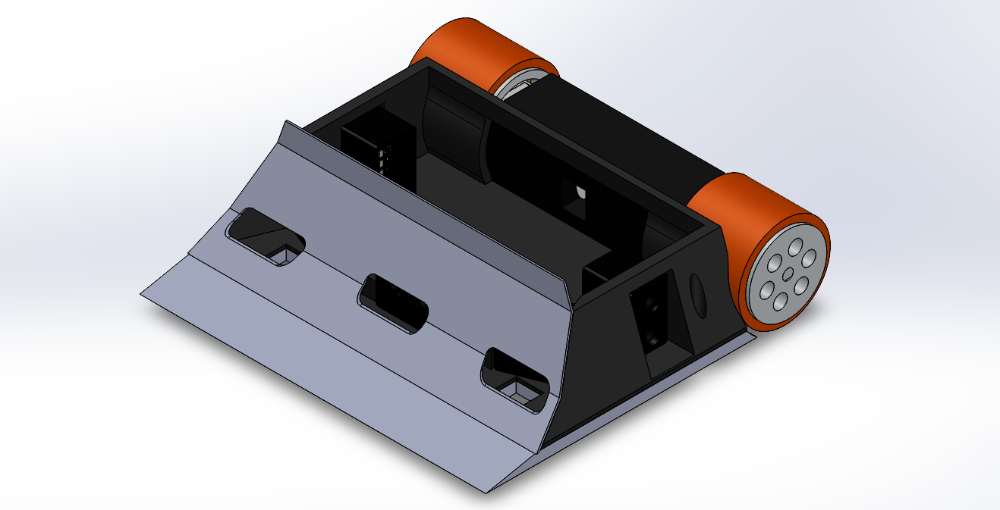
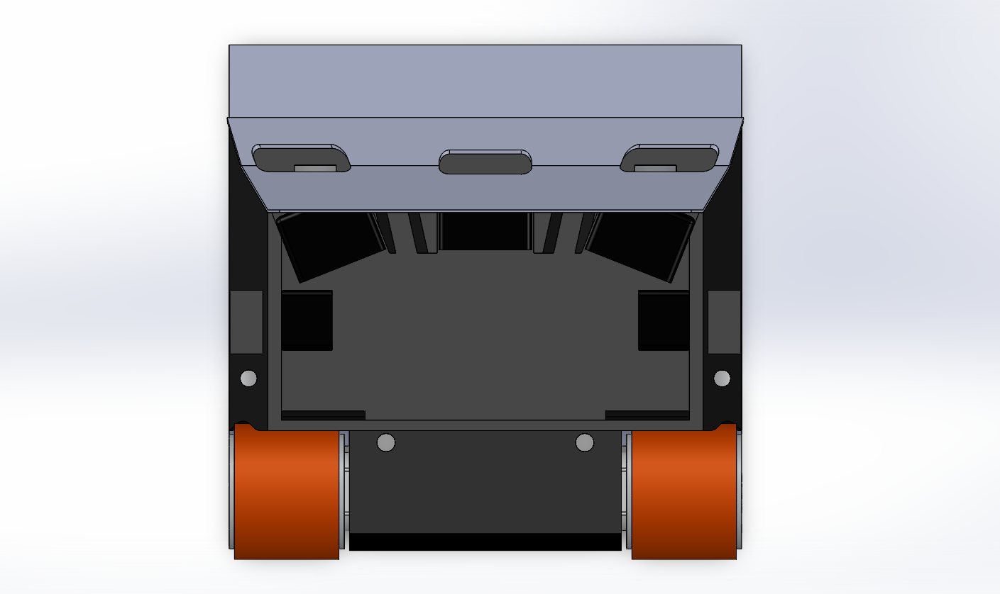
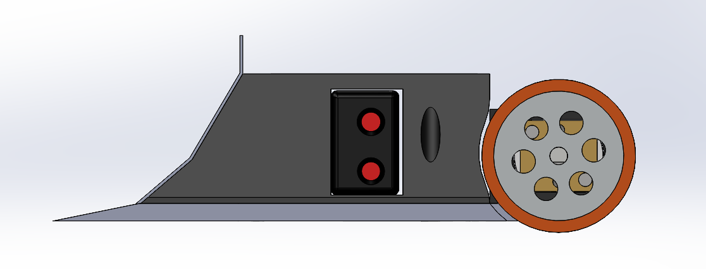
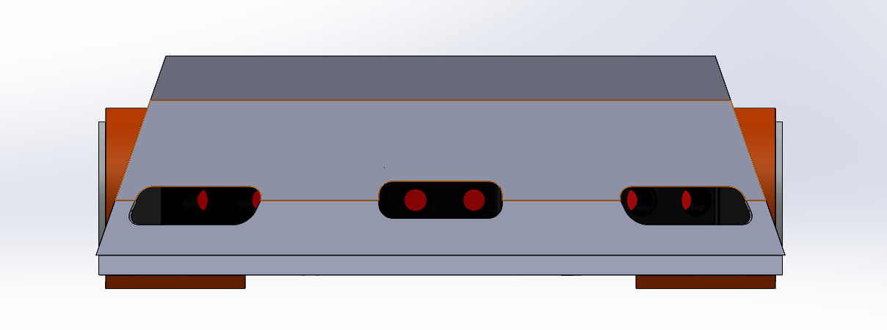
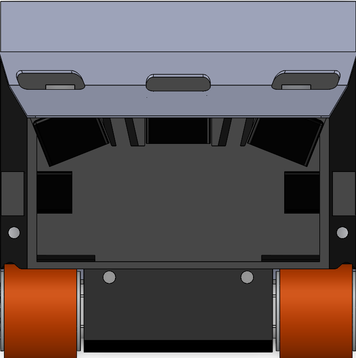

# ⛩️ XT Kaisei - Open-Source Minisumo Robot by XpriTRobotics

**KAISEI** is a **professional minisumo robot** designed for both **beginners** and **advanced users**. Equipped with everything a robot needs to stand out in the ring, it's perfect for learning robotics or as a solid base to build a high-performance sumo project.

---

## 📸 Image Gallery

| View            | Image                         |
|-----------------|-------------------------------|
| Top             |             |
| Side            |            |
| Front           |           |
| Isometric       |             |
| Close Top       |       |

---

## ⚙️ Technical Specifications

| Feature                   | Description                              |
|---------------------------|------------------------------------------|
| Dimensions                | 98mm x 98mm                              |
| Weight                    | ~370g (depends on base material)         |
| Enemy detection sensors   | 5x JS40F                                 |
| Line sensors              | 2x QTR1A                                 |
| Supported motor types     | 050 (Jsumo/Sobotz) or N20 (Pololu, etc.) |
| Motor brackets            | Available for 050 and N20 motors         |
| Battery recommendation    | Ministar 350mAh 3S LiPo                  |
| Base structure            | Customizable (3D printed or other)       |
| Mainboard compatibility   | Universal                                |

---

## 🧠 Compatible Boards

KAISEI supports **virtually any board** that physically fits. However, it is optimized for **Xprit's own boards**.

| Board / MCU        | Compatibility | Notes                             |
|--------------------|---------------|------------------------------------|
| Xprit Boards       | ✅            | Native support recommended         |
| Arduino UNO/Nano   | ✅            | Fully compatible                   |
| ESP32              | ✅            | Great for wireless functionality   |
| STM32              | ✅            |                                    |
| Raspberry Pi Pico  | ✅            |                                    |

---

## 💻 Programming

Programming depends on the chosen microcontroller. KAISEI supports:

- Arduino IDE (C/C++)
- PlatformIO
- MicroPython (on supported boards)
- Other environments as needed

**Common Examples**:
- Enemy detection with JS40F
- Attack and retreat strategies

> Example files will be available soon in the `/code/` folder.

---

## 📦 Components List

| Component              | Suggested Model / Brand     | Quantity |
|------------------------|-----------------------------|----------|
| Object sensors         | JS40F                       | 5        |
| Line sensors           | QTR1A                       | 2        |
| Motors                 | 050 (Jsumo/Sobotz) or N20 (Pololu) | 2        |
| Motor drivers          | JS2622 or compatible        | 2        |
| Battery                | Ministar 350mAh 3S LiPo     | 1        |
| Mainboard              | Compatible board (Xprit, etc.) | 1     |
| Chassis                | 3D printed or custom         | 1        |

---

## 📂 Project Structure

```plaintext
KAISEI/
├── README.md
├── img/
│   ├── Top.jpg
│   ├── Side.jpg
│   ├── Front.jpg
│   ├── Iso.jpg
│   └── Close_Top.jpg
├── code/
│   └── [Upcoming example files]
├── docs/
│   └── [Assembly guides, coming soon]
└── stl/
    └── [3D printable files]
